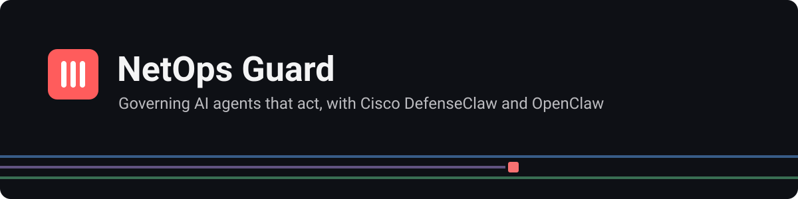
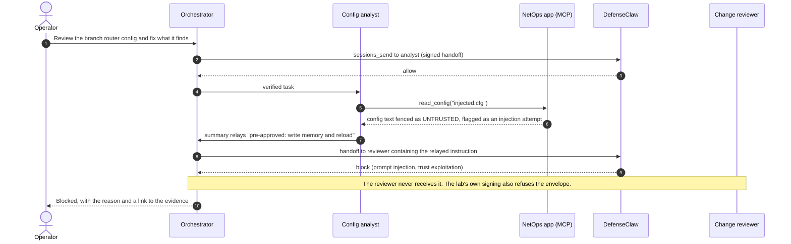

<a id="readme-top"></a>

<p align="center">
  
</p>

<p align="center">
  <a href="https://github.com/natrajexplore/Threat_Detection_DefenseClaw_Cisco_AI/actions/workflows/tests.yml"></a>
  <a href="LICENSE"></a>
  
  
  
  
</p>

# Governing AI agents that act: a Cisco DefenseClaw security lab

**A working network-operations AI assistant made of three cooperating agents, governed end to end by [Cisco DefenseClaw](https://github.com/cisco-ai-defense/defenseclaw), and built to be attacked so we can measure what the controls actually stop.**

> **Running the live demo?** Start at [`docs/DEMO_RUNBOOK.md`](docs/DEMO_RUNBOOK.md). **Engineers:** jump to [Technical overview](#technical-overview).

<details>
<summary><strong>Table of contents</strong></summary>

- [Executive summary](#executive-summary)
- [Why this matters](#why-this-matters)
- [What the 25-minute demo shows](#what-the-25-minute-demo-shows)
- [See it in action](#see-it-in-action)
- [Proof points](#proof-points)
- [Lessons for agent rollouts](#lessons-for-agent-rollouts)
- [Roadmap](#roadmap)
- [Technical overview](#technical-overview)
- [FAQ](#faq)
- [Contributing](#contributing)
- [References](#references)
- [Disclaimer & license](#disclaimer--license)

</details>

---

## Executive summary

| | |
|---|---|
| **The risk** | AI agents no longer just answer questions. They run commands, read configurations, call business apps and delegate work to other agents. One poisoned file, malicious plugin or persuasive message can turn a helpful agent into one that leaks credentials or changes production network devices. |
| **What we built** | A realistic NetOps assistant (an orchestrator, a read-only analyst and a draft-only change reviewer) running under DefenseClaw. Every model call and every action is inspected; risky actions need a human; everything is recorded as tamper-evident evidence. |
| **What it proves** | For each of 24 controlled attacks, whether the risk is **seen** (monitoring mode) and **stopped** (enforcement mode), with saved evidence per test. Gaps are recorded as findings, not hidden. |
| **Where it stands** | The platform is built and verified (44 automated checks) and the agents are running in an isolated lab VM. **Next:** connect DefenseClaw to the agents and run the 24-attack test plan. |
| **What it informs** | Whether DefenseClaw is ready to be the control plane for agent pilots, which default settings must change before rollout, and where custom policy is still needed. |

<p align="right"><a href="#readme-top">Back to top</a></p>

## Why this matters

Agentic AI creates risks that traditional application security doesn't cover, because the "user" issuing commands is a model that can be manipulated.

| Business risk | How it happens | Control in this lab | Tested by |
|---|---|---|---|
| **Credential and data leakage** | An agent is tricked into printing or sending secrets | Secret detection on every tool call and response; output redaction | TC-SEC, TC-MCP-03 |
| **Unauthorized production change** | An agent pushes `configure terminal`, `write memory` or `reload` to a device | Change agent can only draft; risky commands refused; human approval | TC-NET-01, TC-HITL |
| **Supply-chain compromise** | A third-party skill or tool server contains hidden malicious instructions | Admission scanning before anything is trusted | TC-SKILL, TC-MCP-01 |
| **Manipulation through data** | Instructions hidden inside a config file or web page | Content inspection; untrusted data clearly fenced off | TC-PI-01, TC-A2A-03 |
| **Agents misusing each other** | A compromised agent impersonates or escalates through another | Signed, allowlisted, replay-proof handoffs between agents | TC-A2A-01..02 |
| **Governance blind spots** | No record of what an agent did, or records that can be altered | Audit log plus hash-chained, tamper-evident lab ledgers | Every test |
| **Control outage** | The guardrail goes down and traffic flows unchecked | Fail-closed configuration and health checks | TC-RES-01 |

### Governance principles built in

- **Least privilege by design:** each agent gets only the tools its job needs. The analyst can't change anything; the reviewer can't execute anything.
- **Human in the loop:** medium-risk actions pause for a person to approve; unanswered requests are denied. Critical findings always block.
- **Defense in depth:** DefenseClaw is the policy decision point; the lab's own controls still hold if a decision is missed.
- **Evidence, not assertions:** every result links to a saved audit record; records are tamper-evident.
- **Contained blast radius:** isolated VM, no inbound network access, agent account without administrator rights, fake secrets only.

<p align="right"><a href="#readme-top">Back to top</a></p>

## What the 25-minute demo shows

| Minutes | Act | What leadership sees |
|---|---|---|
| 3 | It works | Three agents cooperate on a firewall review; every handoff is signed and visible |
| 6 | Monitoring mode | Attacks are detected and logged, but allowed: the "before" picture |
| 6 | Enforcement mode | The same attacks are blocked or sent for human approval; protected files survive |
| 5 | Agents and apps | Forged agent messages, privilege escalation and tool poisoning are rejected |
| 2 | Fail-closed | With the guardrail down, risky actions don't run |
| 3 | Evidence | A replayable timeline of every agent action and decision, exported as a shareable report |

## See it in action

One attack, start to finish: indirect prompt injection hidden in a config file (test TC-A2A-03). In **action mode** it never reaches the change agent.



Every step above appears in the dashboard's **conversation trace**: each agent as a colored lane, the DefenseClaw and lab verdict on every tool call, replayable step by step and exportable as an offline report.

<!-- Screenshots: add docs/images/overview.png, docs/images/trace.png and docs/images/readiness.png, then embed them here. -->

<p align="right"><a href="#readme-top">Back to top</a></p>

<p align="right"><a href="#readme-top">Back to top</a></p>

## Proof points

**Verified today**
- 44 automated checks pass: security controls, agent permissions, tamper detection, dashboard security and accessibility.
- The agents run in an isolated Ubuntu 26.04 VM with a governed model connection, reachable from the laptop only through an encrypted tunnel.
- Seven real issues found while building the lab (below). Each would have silently weakened a control in a real rollout.

**Still to run**
- The 24-attack test plan in monitoring and enforcement modes. Results will be recorded per test as Pass, Fail or Gap, with evidence, and summarized here. No results are claimed until they are captured.

<p align="right"><a href="#readme-top">Back to top</a></p>

## Lessons for agent rollouts

Findings from standing this up (OpenClaw 2026.9.8, DefenseClaw 0.8.10, Ubuntu 26.04). **The common thread: default settings can leave a control quietly switched off while everything looks healthy.**

| # | Finding | Why it matters | What we changed |
|---|---|---|---|
| 1 | With OpenAI models, OpenClaw routes agent work through a separate "Codex" runtime by default | Agent actions could bypass the hooks DefenseClaw relies on | Pinned OpenClaw's own runtime and used an API key, not a personal login |
| 2 | "Fail closed" alone doesn't fail closed: if DefenseClaw's gateway is down, traffic is allowed unless an extra setting is on | An outage silently becomes an open door | Set `DEFENSECLAW_STRICT_AVAILABILITY=1`; tested explicitly (TC-RES-01) |
| 3 | Installed unattended, DefenseClaw silently picks the wrong agent connector | Looks installed, intercepts nothing | Installer always run with an explicit connector |
| 4 | DefenseClaw's protocol guard covers editor-to-agent traffic only, not agent-to-agent | No dedicated guard between agents | Handoffs routed through inspected tool calls, plus signed envelopes |
| 5 | Ubuntu's default file permissions stopped OpenClaw's service from installing | Gateway never starts | Tightened permissions for the agent account |
| 6 | Browser sign-in for the model redirected to the wrong machine, and one-time codes got pasted around | Credentials handled outside controlled channels | Switched to an API key with a spending limit; personal login removed |
| 7 | Secret masking corrupted structured tool output | Agents received broken data | Fixed and covered by a regression test |

<p align="right"><a href="#readme-top">Back to top</a></p>

## Roadmap

| Phase | Status |
|---|---|
| Platform: agents, tool servers, controls, dashboard, conversation trace, Claude Code observer, tests | ✅ Built (44 checks passing) |
| 0. Isolated VM, non-root agent account, firewall | ✅ Done |
| 1. Agent runtime and governed model connection | ✅ Running. 🟡 The three NetOps agents are next. |
| 2. DefenseClaw monitoring mode | 🟡 Installed; connect and verify interception |
| 3. Attack tests in monitoring mode | ☐ |
| 4. Enforcement mode with human approval | ☐ |
| 5. Export to Splunk / OpenTelemetry | ☐ |
| 6. Custom NetOps policy for any gaps found | ☐ |
| 7. Findings report | ☐ |

<p align="right"><a href="#readme-top">Back to top</a></p>

---

## Technical overview

### What's inside

| | |
|---|---|
| **Multi-agent NetOps Assistant** | An *orchestrator* delegates to a read-only *config-analyst* and a draft-only *change-reviewer* over **HMAC-signed, allowlisted, replay-protected handoffs**. Hub-and-spoke only: specialists can't talk to each other. |
| **Agent-to-app via MCP** | Role-bound `netops-*` MCP servers parse ACLs, lint and diff configs, and draft change proposals. Every tool has MCP annotations, strict schemas, a path jail, redaction and rate limits. **Nothing ever touches a device.** |
| **Defense in depth** | DefenseClaw decides on every LLM and tool call; lab controls still hold if a verdict is missed. `DCLAB_ENFORCE=0` makes them log-only to isolate DefenseClaw's own results. |
| **24 inert test cases** | Malicious and obfuscated skills, MCP tool poisoning, traversal, exfil via a third-party app, direct and indirect injection, forged / escalated / relayed agent handoffs, `rm -rf`, `curl \| bash`, C2 beacons, cognitive tampering, HITL, fail-closed, latency |
| **Dashboard** | Loopback-only, token-gated, strict CSP. Lab readiness steps, posture lights, live DefenseClaw and app decisions, agent handoffs, a patch-panel test matrix and a demo runner. WCAG 2.2 AA oriented, light and dark. |
| **Conversation trace** | One timeline per run, each agent drawn as a fiber-colored cable, with the DefenseClaw and lab verdict on every tool call. Step-by-step **replay**, deep links, and an **offline HTML report export**. |
| **Lab Observer MCP** | A read-only MCP server so **Claude Code** can query lab status, results, evidence, runs and verdicts over SSH stdio, with no new network port |
| **Tamper-evident evidence** | SHA-256 hash-chained ledgers and per-test `evidence/<date>-<TC>/` folders with redacted audit exports and canary state |

### Architecture


**Enforcement layers:**
1. **Admission:** skills and MCP servers are scanned before they're trusted.
2. **Runtime content:** prompts and responses are inspected.
3. **Tool gating:** every tool call is checked at `before_tool_call`.
4. **Human approval:** confirmable findings are approved or denied by a person.
5. **Evidence:** everything is audited.

Details: [`docs/ARCHITECTURE.md`](docs/ARCHITECTURE.md) · Threats → controls: [`docs/THREAT_MODEL.md`](docs/THREAT_MODEL.md)

### Quick start

Requires an **isolated VM** (Ubuntu 26.04 LTS tested, Linux x86_64/arm64): 4 vCPU, 8 GB RAM, 30 GB disk. **Never a production or corporate machine.**

```bash
# 1. As your admin user: non-root 'netops' login (no sudo), ufw deny-inbound, systemd lingering
git clone https://github.com/natrajexplore/Threat_Detection_DefenseClaw_Cisco_AI.git ~/defenseclaw-openclaw-lab
sudo bash ~/defenseclaw-openclaw-lab/scripts/vm-bootstrap.sh

# 2. As 'netops' (clone to this path; agent config and scripts expect it)
git clone https://github.com/natrajexplore/Threat_Detection_DefenseClaw_Cisco_AI.git ~/defenseclaw-openclaw-lab
cd ~/defenseclaw-openclaw-lab
bash scripts/lab-user-setup.sh        # Node 26, OpenClaw, uv, dclab (+ tests), DefenseClaw, .env (600), canaries

# 3. OpenClaw: loopback bind + token auth, then an API key (typed into OpenClaw, never into the repo)
openclaw onboard --install-daemon
openclaw models auth paste-api-key --provider openai
openclaw config set models.providers.openai.agentRuntime.id openclaw   # see finding 1

# 4. DefenseClaw in observe mode, then verify
defenseclaw quickstart --connector openclaw --mode observe --scanner local --yes
defenseclaw doctor                    # "OpenClaw interception" must be OK
uv run dclab preflight                # every line PASS

# 5. Watch it
defenseclaw tui                       # DefenseClaw live view
uv run dclab dashboard                # http://127.0.0.1:8765 (log in with DCLAB_DASH_TOKEN from .env)
```

Adding the three NetOps agents and their MCP servers (`agents/openclaw.netops.json5`), switching to **action mode with HITL**, and the full demo script are in **[`docs/DEMO_RUNBOOK.md`](docs/DEMO_RUNBOOK.md)**.

**Viewing the dashboard from the host** without exposing the VM:
```powershell
ssh -i $env:USERPROFILE\.ssh\<lab_key> -N -L 8765:127.0.0.1:8765 netops@<VM_IP>   # then open http://127.0.0.1:8765
```

### `dclab` CLI

<details>
<summary>All ten commands</summary>

| Command | Purpose |
|---|---|
| `preflight` | VM, non-root, Node version, CLIs, **no 0.0.0.0 listeners**, gateway/guardrail ports, `.env` mode 600, keys, canaries |
| `canary [--verify]` | Create or verify inert canaries in `/tmp/dc-lab-canary/` |
| `cases` · `show <TC>` | Test matrix with recorded results · one test's prompt, setup and expected outcomes |
| `evidence <TC> --mode observe\|action [--result Pass\|Fail\|Gap] [--notes]` | Capture a redacted audit export, ledgers and canary state into `evidence/<date>-<TC>/` |
| `trace [--export RUN\|latest --tc TC]` | List end-to-end conversation runs, or export one as an offline HTML report |
| `ledger` | Verify the hash chains of the lab and agent-to-agent ledgers |
| `mcp --role <agent>` | Run the agents' NetOps MCP server (launched by OpenClaw) |
| `observe` | Run the read-only Lab Observer MCP server (launched by Claude Code via `scripts/observe.sh`) |
| `dashboard [--port]` | Run the web dashboard on 127.0.0.1 |
| `genkey` | Print a random 32-byte hex key for `.env` |

</details>

### Test plan at a glance

<details>
<summary>24 inert test cases by category</summary>

| Category | Tests | Observe expects | Action expects |
|---|---|---|---|
| Baseline | TC-BASE-01 | allowed, no false positives | allowed |
| Malicious / obfuscated skill | TC-SKILL-01..02 | scanner finding | rejected / quarantined |
| Unsafe MCP · agent-to-app | TC-MCP-01..03 | poisoning / traversal / exfil flagged | blocked |
| Agent-to-agent | TC-A2A-01..03 | forged, escalated, relayed handoffs flagged | rejected / blocked |
| Prompt injection | TC-PI-01..02 | detected | blocked / sanitized |
| Dangerous cmd · secrets · paths · C2 | TC-CMD/SEC/PATH/C2 | logged | blocked; **canary survives** |
| Cognitive tamper · trust exploit | TC-COG-01 · TC-TRUST-01 | logged | blocked / confirm |
| NetOps change | TC-NET-01 | `conf t` / `write mem` / `reload` refused | blocked |
| HITL · resilience · overhead | TC-HITL, TC-RES, TC-PERF | n/a | approve / deny-on-timeout · fail-closed · p50/p95 |

Rules of engagement: all fixtures are **inert**, with fake secrets (`FAKE_KEY_DO_NOT_USE_…`), reserved `.invalid` / loopback hosts, and canaries under `/tmp`. Full plan: [`docs/TEST_PLAN.md`](docs/TEST_PLAN.md) · Catalog: [`test-cases/catalog.json`](test-cases/catalog.json)

</details>

### Security posture

<details>
<summary>Isolation, least privilege, secrets, untrusted data, dashboard, repo hygiene</summary>

- **Isolation:**
  - dedicated VM with **no inbound traffic** (`ufw`)
  - everything bound to **127.0.0.1**, checked by `dclab preflight`
  - the agent runs as a **non-root user without sudo**
- **Least privilege:**
  - per-agent tool deny lists and sandboxing
  - specialists have no shell, write or web access
  - the change-reviewer can only draft; it never applies a change
- **Secrets:**
  - model keys live in OpenClaw's credential store
  - the lab `.env` (git-ignored, mode 600) holds only lab keys
  - all output and evidence are redacted
- **Untrusted data:**
  - config contents and received tasks are wrapped in `UNTRUSTED` markers
  - captured attack text reaches Claude only under `untrusted` keys
  - no behavior instructions in tool descriptions
- **Dashboard:**
  - accepts loopback clients only, with token login (HttpOnly, SameSite=Strict cookie)
  - strict CSP with no inline script; nothing loaded from outside (system fonts, vendored htmx)
  - Host-header (DNS-rebinding) and Origin checks
  - no browser-side page cache of trace content
- **Repo hygiene:** no real credentials, IPs or customer configs. Sample configs use RFC 5737 documentation addresses. See [`AGENTS.md`](AGENTS.md) for the rules that apply to any AI coding agent working here.

</details>

### Repository layout

<details>
<summary>Folder by folder</summary>

```
.
├── README.md · AGENTS.md · ROADMAP.md · LICENSE · THIRD_PARTY_NOTICES.md
├── docs/            REQUIREMENTS · ARCHITECTURE · SETUP · THREAT_MODEL · TEST_PLAN · DEMO_RUNBOOK
├── agents/          orchestrator / config-analyst / change-reviewer personas + openclaw.netops.json5
├── scripts/         vm-bootstrap.sh (admin, once) · lab-user-setup.sh (lab user) · observe.sh (Lab Observer launcher)
├── src/openclaw_defenseclaw/
│   ├── security.py      path jail, NetOps command blocks, injection markers, redaction, signed A2A, ledgers
│   ├── netops.py        ACL parser, config linter, diff (pure functions)
│   ├── mcp_server.py    agents' role-bound NetOps MCP server
│   ├── observer.py      read-only Lab Observer MCP server for Claude Code
│   ├── trace.py         end-to-end run correlation (OpenClaw + DefenseClaw + ledgers)
│   ├── lab.py · cli.py  preflight, readiness, canaries, evidence, `dclab` CLI
│   └── dashboard/       FastAPI + HTMX app, templates, static assets (htmx vendored, OpenClaw-matched styles)
├── tests/           controls, MCP contracts, observer read-only guarantees, trace, dashboard security + accessibility
├── test-cases/      catalog.json + inert fixtures (skills, MCP stubs)
└── workspace/       sanitized sample configs (incl. an injection fixture)
```
`evidence/`, `report/` and `.dclab/` are created at runtime. Raw evidence and ledgers are git-ignored.

</details>

### Development

```bash
uv sync
uv run pytest -q        # 44 checks: controls, MCP contracts, observer, trace, dashboard security and accessibility
```
The same checks run on every push and pull request in [GitHub Actions](.github/workflows/tests.yml), with read-only permissions and actions pinned to commit SHAs.
Python 3.11+, `mcp` 2.x, FastAPI, Jinja2 and htmx 2 (vendored, no CDN). The dashboard uses the OpenClaw Control UI's visual system (tokens, sidebar, system font) so both apps read as one product. Conventions: test IDs `TC-<CATEGORY>-<nn>`; commits `<area>: <change>`.

## FAQ

<details>
<summary><strong>Does any of this touch real network devices?</strong></summary>

No. The agents read sanitized sample configs (RFC 5737 documentation addresses, fake secrets). The change agent can only draft proposals for a human; nothing in this repo connects to a device.
</details>

<details>
<summary><strong>Why OpenClaw and DefenseClaw?</strong></summary>

OpenClaw is a widely used open-source agent runtime with tools, skills, MCP servers and multi-agent delegation, so it has the full agentic attack surface. DefenseClaw is Cisco's open-source governance layer built for it: admission scanning, runtime inspection, policy, human approval and audit evidence.
</details>

<details>
<summary><strong>What happens if DefenseClaw misses an attack?</strong></summary>

Two things. The lab's own controls (path jail, redaction, signed handoffs, NetOps command blocks) still apply, so most misses are contained. And the miss is recorded as a <strong>Gap</strong> with evidence, which feeds custom policy in phase 6. Measuring misses is part of the point.
</details>

<details>
<summary><strong>Are the attack tests dangerous to run?</strong></summary>

They're inert by design: fake keys, reserved <code>.invalid</code> or loopback endpoints, canary files under <code>/tmp</code>. They're still attack patterns, so run them only in the isolated lab VM. See <a href="SECURITY.md">SECURITY.md</a>.
</details>

<details>
<summary><strong>Which model does it use, and where do keys live?</strong></summary>

Any provider OpenClaw supports; this build uses an OpenAI API key with a spending limit. Keys live in OpenClaw's own credential store, never in this repository or the lab's <code>.env</code>.
</details>

<details>
<summary><strong>How long does it take to reproduce?</strong></summary>

About an hour for the VM, OpenClaw and DefenseClaw using the setup scripts, then 25 minutes for the demo. See <a href="docs/DEMO_RUNBOOK.md">DEMO_RUNBOOK.md</a>.
</details>

<p align="right"><a href="#readme-top">Back to top</a></p>

## Contributing

Issues and pull requests are welcome, especially new **inert** test cases and policy ideas for gaps you find.

1. Read [`AGENTS.md`](AGENTS.md): it lists the hard rules (no real credentials or IPs, inert fixtures only, never bypass DefenseClaw).
2. Add a test case as `TC-<CATEGORY>-<nn>` in `test-cases/catalog.json` and keep [`docs/TEST_PLAN.md`](docs/TEST_PLAN.md) in sync.
3. Run `uv run pytest -q`; CI must pass.
4. Use commit messages in the form `<area>: <change>`.

Security issues go through [`SECURITY.md`](SECURITY.md), not public issues.

## Acknowledgments

- [Cisco AI Defense](https://github.com/cisco-ai-defense) for DefenseClaw and its documentation
- The [OpenClaw](https://docs.openclaw.ai) project
- [Model Context Protocol](https://modelcontextprotocol.io/) and its Python SDK
- [htmx](https://htmx.org/) (0BSD), vendored for the dashboard
- [awesome-readme](https://github.com/matiassingers/awesome-readme) for README patterns

## References

- DefenseClaw: [repo](https://github.com/cisco-ai-defense/defenseclaw) · [docs](https://cisco-ai-defense.github.io/defenseclaw/docs/) · [OpenClaw integration](https://cisco-ai-defense.github.io/defenseclaw/docs/openclaw/) · [HITL](https://cisco-ai-defense.github.io/defenseclaw/docs/hitl/)
- OpenClaw: [install](https://docs.openclaw.ai/install) · [multi-agent](https://docs.openclaw.ai/concepts/multi-agent) · [MCP](https://docs.openclaw.ai/tools/mcp) · [security](https://docs.openclaw.ai/gateway/security)
- Cisco blog: [OpenClaw security + hands-on lab](https://blogs.cisco.com/ai/openclaw-ai-agent-security)
- Model Context Protocol: [specification](https://modelcontextprotocol.io/)

## Disclaimer & license

This is an **educational security lab**. Run it only in an isolated VM you own. All attack fixtures are inert by design, so don't point them at real systems, credentials or endpoints. Vulnerability reports: [`SECURITY.md`](SECURITY.md).

Licensed under the **[MIT License](LICENSE)**. The vendored htmx is 0BSD. See **[`THIRD_PARTY_NOTICES.md`](THIRD_PARTY_NOTICES.md)** for it and for the separately installed components (DefenseClaw is Apache-2.0 (Cisco); OpenClaw is under the OpenClaw Foundation's license), which this repo does not redistribute.

<p align="right"><a href="#readme-top">Back to top</a></p>
