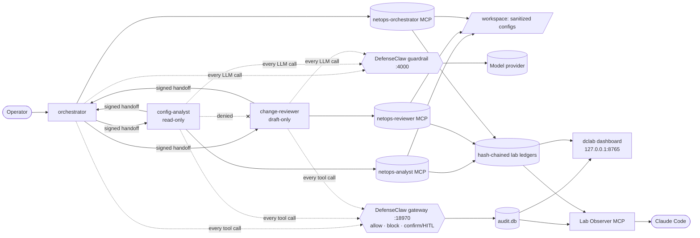

# Threat Detection with Cisco DefenseClaw: a secured multi-agent NetOps Assistant

A hands-on security lab that deploys a **multi-agent [OpenClaw](https://docs.openclaw.ai) NetOps Assistant**, governs it with **[Cisco DefenseClaw](https://github.com/cisco-ai-defense/defenseclaw)**, attacks it with inert, controlled scenarios, and records what was **seen** (observe mode) and what was **blocked** (action mode), with evidence for each test.

> **Running the team demo?** Start at **[`docs/DEMO_RUNBOOK.md`](docs/DEMO_RUNBOOK.md)**: an empty Ubuntu VM to a 25-minute demo.

---

## Why this project

OpenClaw moves AI from *chat* to *act*: one model wired to a shell, files, skills, MCP servers and other agents. That creates a real attack surface:
- malicious third-party skills
- poisoned MCP tool descriptions
- prompt injection hidden in data
- agents talking other agents into things
- secrets leaking out through tool calls

DefenseClaw is Cisco's open-source governance layer for these runtimes:
- scans skills and MCP servers before they're trusted
- inspects every LLM call and tool call at runtime
- enforces policy, with optional human approval
- keeps an audit trail

This lab shows the whole loop on a realistic use case: **deploy → harden → attack → enforce → evidence**.

## What's inside

| | |
|---|---|
| 🤖 **Multi-agent NetOps Assistant** | An *orchestrator* delegates to a read-only *config-analyst* and a draft-only *change-reviewer* over **HMAC-signed, allowlisted, replay-protected handoffs**. Hub-and-spoke only: the specialists can't talk to each other. |
| 🔌 **Agent-to-app via MCP** | Role-bound `netops-*` MCP servers parse ACLs, lint configs, diff configs and draft change proposals. Every tool carries MCP annotations, strict schemas, a path jail, redaction and rate limits. **Nothing ever touches a device.** |
| 🛡️ **Defense in depth** | DefenseClaw is the policy decision point for every LLM and tool call. The lab's own controls still hold if a verdict is missed, and `DCLAB_ENFORCE=0` turns them log-only to show DefenseClaw on its own. |
| 🧪 **24 inert test cases** | Malicious and obfuscated skills, MCP tool poisoning, path traversal, exfil via a third-party "app", direct and indirect injection, **forged / escalated / relayed agent handoffs**, `rm -rf`, `curl \| bash`, C2 beacons, cognitive tampering, HITL, fail-closed, latency |
| 📊 **Dashboard** | Loopback-only, token-gated, strict CSP. Shows posture, a live DefenseClaw verdict feed, agent-to-agent handoffs, lab-control decisions, the observe-vs-action test matrix and a demo runner. |
| 🧵 **Conversation trace** | One end-to-end timeline per run (operator → orchestrator → specialists → apps) with the DefenseClaw and lab verdict on every tool call. **Step-by-step replay** for presenting, and an **offline HTML report export** for the team. |
| 🔭 **Lab Observer MCP** | A read-only MCP server so **Claude Code** can query the lab (status, results, evidence, runs, verdicts) over SSH stdio, with no new network port |
| 🧾 **Tamper-evident evidence** | SHA-256 hash-chained ledgers, and per-test `evidence/<date>-<TC>/` folders with redacted audit exports and canary state |

## Architecture



**Enforcement layers:**
1. **Admission:** skills and MCP servers are scanned before they're trusted.
2. **Runtime content:** prompts and responses are inspected.
3. **Tool gating:** every tool call is checked at `before_tool_call`.
4. **Human approval:** confirmable findings are approved or denied by a person.
5. **Evidence:** everything is audited.

Details: [`docs/ARCHITECTURE.md`](docs/ARCHITECTURE.md) · Threats → controls: [`docs/THREAT_MODEL.md`](docs/THREAT_MODEL.md)

## Quick start

Requires an **isolated VM** (Ubuntu 26.04 LTS tested, Linux x86_64/arm64): 4 vCPU, 8 GB RAM, 30 GB disk. **Never a production or corporate machine.**

```bash
# 1. As your admin user: non-root 'netops' login (no sudo), ufw deny-inbound, systemd lingering
git clone https://github.com/natrajexplore/Threat_Detection_DefenseClaw_Cisco_AI.git ~/defenseclaw-openclaw-lab
sudo bash ~/defenseclaw-openclaw-lab/scripts/vm-bootstrap.sh

# 2. As 'netops' (clone to this path; agent config and scripts expect it)
git clone https://github.com/natrajexplore/Threat_Detection_DefenseClaw_Cisco_AI.git ~/defenseclaw-openclaw-lab
cd ~/defenseclaw-openclaw-lab
bash scripts/lab-user-setup.sh        # Node 26, OpenClaw, uv, dclab (+ tests), DefenseClaw, .env (600), canaries

# 3. OpenClaw: loopback bind + token auth, then an API key (typed into OpenClaw, never into the repo)
openclaw onboard --install-daemon
openclaw models auth paste-api-key --provider openai
openclaw config set models.providers.openai.agentRuntime.id openclaw   # see Findings #1

# 4. DefenseClaw in observe mode, then verify
defenseclaw quickstart --connector openclaw --mode observe --scanner local --yes
defenseclaw doctor                    # "OpenClaw interception" must be OK
uv run dclab preflight                # every line PASS

# 5. Watch it
defenseclaw tui                       # DefenseClaw live view
uv run dclab dashboard                # http://127.0.0.1:8765 (log in with DCLAB_DASH_TOKEN from .env)
```

Adding the three NetOps agents and their MCP servers (`agents/openclaw.netops.json5`), switching to **action mode with HITL**, and the full demo script are in **[`docs/DEMO_RUNBOOK.md`](docs/DEMO_RUNBOOK.md)**.

**Viewing the dashboard from the host** without exposing the VM:
```powershell
ssh -i $env:USERPROFILE\.ssh\<lab_key> -N -L 8765:127.0.0.1:8765 netops@<VM_IP>   # then open http://127.0.0.1:8765
```

## `dclab` CLI

| Command | Purpose |
|---|---|
| `preflight` | VM, non-root, Node version, CLIs, **no 0.0.0.0 listeners**, gateway/guardrail ports, `.env` mode 600, keys, canaries |
| `canary [--verify]` | Create or verify inert canaries in `/tmp/dc-lab-canary/` |
| `cases` · `show <TC>` | Test matrix with recorded results · one test's prompt, setup and expected outcomes |
| `evidence <TC> --mode observe\|action [--result Pass\|Fail\|Gap] [--notes]` | Capture a redacted audit export, ledgers and canary state into `evidence/<date>-<TC>/` |
| `trace [--export RUN\|latest --tc TC]` | List end-to-end conversation runs, or export one as an offline HTML report |
| `ledger` | Verify the hash chains of the lab and agent-to-agent ledgers |
| `mcp --role <agent>` | Run the agents' NetOps MCP server (launched by OpenClaw) |
| `observe` | Run the read-only Lab Observer MCP server (launched by Claude Code via `scripts/observe.sh`) |
| `dashboard [--port]` | Run the web dashboard on 127.0.0.1 |
| `genkey` | Print a random 32-byte hex key for `.env` |

## Test plan at a glance

| Category | Tests | Observe expects | Action expects |
|---|---|---|---|
| Baseline | TC-BASE-01 | allowed, no false positives | allowed |
| Malicious / obfuscated skill | TC-SKILL-01..02 | scanner finding | rejected / quarantined |
| Unsafe MCP · agent-to-app | TC-MCP-01..03 | poisoning / traversal / exfil flagged | blocked |
| Agent-to-agent | TC-A2A-01..03 | forged, escalated, relayed handoffs flagged | rejected / blocked |
| Prompt injection | TC-PI-01..02 | detected | blocked / sanitized |
| Dangerous cmd · secrets · paths · C2 | TC-CMD/SEC/PATH/C2 | logged | blocked; **canary survives** |
| Cognitive tamper · trust exploit | TC-COG-01 · TC-TRUST-01 | logged | blocked / confirm |
| NetOps change | TC-NET-01 | `conf t` / `write mem` / `reload` refused | blocked |
| HITL · resilience · overhead | TC-HITL, TC-RES, TC-PERF | n/a | approve / deny-on-timeout · fail-closed · p50/p95 |

Rules of engagement: all fixtures are **inert**, with fake secrets (`FAKE_KEY_DO_NOT_USE_…`), reserved `.invalid` / loopback hosts, and canaries under `/tmp`. Full plan: [`docs/TEST_PLAN.md`](docs/TEST_PLAN.md) · Catalog: [`test-cases/catalog.json`](test-cases/catalog.json)

## Findings from building the lab

Real issues hit while standing this up on Ubuntu 26.04 with OpenClaw 2026.9.8 and DefenseClaw 0.8.10. Each one is a control that would otherwise silently not apply.

| # | Finding | Impact | Fix used here |
|---|---|---|---|
| 1 | **OpenAI on the official endpoint defaults to the Codex harness** in OpenClaw (per its config schema) | Agent turns may bypass the OpenClaw runtime that DefenseClaw's plugin hooks | Pin `models.providers.openai.agentRuntime.id = "openclaw"` and use an API-key profile |
| 2 | `--fail-mode closed` **alone is not fail-closed**. Per `defenseclaw quickstart --help`, transport failures (gateway down or 5xx) always *allow* unless `DEFENSECLAW_STRICT_AVAILABILITY=1` | Stopping the gateway lets risky calls through | Set the env var for TC-RES-01; without it, record a **Gap** |
| 3 | Run non-interactively (e.g. over SSH), the DefenseClaw installer **silently picks the `codex` connector** and skips the OpenClaw plugin | Nothing is intercepted while it looks installed | `install.sh … \| bash -s -- --connector openclaw --yes` |
| 4 | ACP Guard covers **editor ↔ agent** only, and OpenClaw isn't an ACP entry point | There's no dedicated agent-to-agent guard | A2A goes through tool calls (`sessions_send`, MCP `a2a_*`) that DefenseClaw inspects, plus signed envelopes |
| 5 | Ubuntu's default `umask 0002` leaves `~/.config` group-writable, so **OpenClaw refuses to install its gateway service** | The gateway never starts | `chmod 700 ~/.config`, `umask 027` for the lab user |
| 6 | OpenAI browser sign-in redirects to `localhost:1455`, which **fails when the link is opened on the host** instead of in the VM | Login loops; one-time codes get pasted around | Use `paste-api-key`. Never paste callback URLs or codes anywhere. |
| 7 | Redacting secrets in pretty-printed JSON with a greedy `\S+` **ate closing quotes** | Agents received invalid JSON from `lint_config` | Secret values stop at quotes, with a regression test |

## Security posture

- **Isolation:**
  - dedicated VM, with **no inbound traffic** (`ufw`)
  - everything bound to **127.0.0.1**, checked by `dclab preflight`
  - the agent runs as a **non-root user without sudo**
- **Least privilege:**
  - per-agent tool deny lists and sandboxing
  - specialists have no shell, write or web access
  - the change-reviewer can only draft; it never applies a change
- **Secrets:**
  - model keys live in OpenClaw's credential store
  - the lab `.env` (git-ignored, mode 600) holds only lab keys
  - all output and evidence are redacted
- **Untrusted data:**
  - config contents and received tasks are wrapped in `UNTRUSTED` markers
  - captured attack text reaches Claude only under `untrusted` keys
  - no behavior instructions in tool descriptions
- **Dashboard:**
  - accepts loopback clients only, with token login (HttpOnly, SameSite=Strict cookie)
  - strict CSP with no inline script, a Host-header (DNS-rebinding) check, and an Origin check on POST
- **Repo hygiene:** no real credentials, IPs or customer configs. Sample configs use RFC 5737 documentation addresses. See [`AGENTS.md`](AGENTS.md) for rules that apply to any AI coding agent working here.

## Repository layout

```
.
├── README.md · AGENTS.md · ROADMAP.md
├── docs/            REQUIREMENTS · ARCHITECTURE · SETUP · THREAT_MODEL · TEST_PLAN · DEMO_RUNBOOK
├── agents/          orchestrator / config-analyst / change-reviewer personas + openclaw.netops.json5
├── scripts/         vm-bootstrap.sh (admin, once) · lab-user-setup.sh (lab user) · observe.sh (Lab Observer launcher)
├── src/openclaw_defenseclaw/
│   ├── security.py      path jail, NetOps command blocks, injection markers, redaction, signed A2A, ledgers
│   ├── netops.py        ACL parser, config linter, diff (pure functions)
│   ├── mcp_server.py    agents' role-bound NetOps MCP server
│   ├── observer.py      read-only Lab Observer MCP server for Claude Code
│   ├── trace.py         end-to-end run correlation (OpenClaw + DefenseClaw + ledgers)
│   ├── lab.py · cli.py  preflight, canaries, evidence, `dclab` CLI
│   └── dashboard/       FastAPI + HTMX app, templates, static assets (htmx vendored)
├── tests/           controls, MCP contracts, observer read-only guarantees, trace, dashboard hardening
├── test-cases/      catalog.json + inert fixtures (skills, MCP stubs)
└── workspace/       sanitized sample configs (incl. an injection fixture)
```
`evidence/`, `report/` and `.dclab/` are created at runtime. Raw evidence and ledgers are git-ignored.

## Development

```bash
uv sync
uv run pytest -q        # 32 tests: controls, MCP contracts, observer, trace, dashboard security
```
Python 3.11+, `mcp` 2.x, FastAPI, Jinja2, and htmx (vendored, no CDN). Conventions: test IDs `TC-<CATEGORY>-<nn>`; commits `<area>: <change>`. The rules for AI coding agents are in [`AGENTS.md`](AGENTS.md).

## Status

| Phase | Status |
|---|---|
| Lab tooling: agents, MCP servers, controls, dashboard, trace, observer, tests | ✅ Built (32 tests passing) |
| 0 – Isolated VM, non-root lab user, firewall | ✅ |
| 1 – OpenClaw baseline (installed, onboarded, loopback gateway) | 🟡 Model auth + NetOps agents pending |
| 2 – DefenseClaw observe | 🟡 Installed; quickstart + interception check pending |
| 3 – Attack tests (observe) | ☐ |
| 4 – Action mode + HITL | ☐ |
| 5 – Observability (Splunk / OTel) | ☐ |
| 6 – Custom NetOps policy (stretch) | ☐ |
| 7 – Findings report | ☐ |

## References

- DefenseClaw: [repo](https://github.com/cisco-ai-defense/defenseclaw) · [docs](https://cisco-ai-defense.github.io/defenseclaw/docs/) · [OpenClaw integration](https://cisco-ai-defense.github.io/defenseclaw/docs/openclaw/) · [HITL](https://cisco-ai-defense.github.io/defenseclaw/docs/hitl/)
- OpenClaw: [install](https://docs.openclaw.ai/install) · [multi-agent](https://docs.openclaw.ai/concepts/multi-agent) · [MCP](https://docs.openclaw.ai/tools/mcp) · [security](https://docs.openclaw.ai/gateway/security)
- Cisco blog: [OpenClaw security + hands-on lab](https://blogs.cisco.com/ai/openclaw-ai-agent-security)
- Model Context Protocol: [specification](https://modelcontextprotocol.io/)

## Disclaimer & license

This is an **educational security lab**. Run it only in an isolated VM you own. All attack fixtures are inert by design, so don't point them at real systems, credentials or endpoints.

Licensed under the **[MIT License](LICENSE)**. The vendored htmx is 0BSD. See **[`THIRD_PARTY_NOTICES.md`](THIRD_PARTY_NOTICES.md)** for it and for the separately installed components (DefenseClaw is Apache-2.0 (Cisco); OpenClaw is under the OpenClaw Foundation's license), which this repo does not redistribute.
