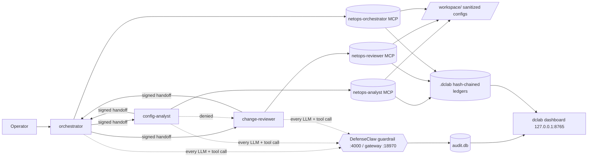
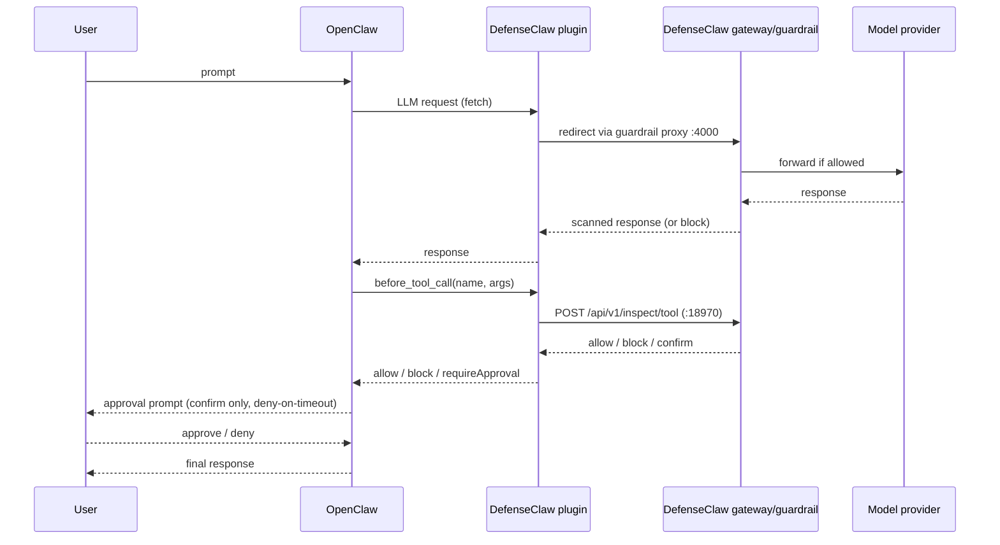

# Architecture

## Components

| Component | Where | Role |
|---|---|---|
| **OpenClaw** | VM, user space (`~/.openclaw`) | Agent runtime: model + tools + skills + MCP + workspace |
| **DefenseClaw plugin** | `~/.openclaw/extensions/defenseclaw/` | TypeScript plugin. Intercepts outbound LLM traffic (fetch / http(s) / undici) and hooks `before_tool_call` |
| **defenseclaw-gateway** | Go sidecar, `127.0.0.1:18970` | Policy evaluation, verdicts (allow / block / confirm), audit writes |
| **Guardrail proxy** | `127.0.0.1:4000` | Inspects LLM requests/responses before they reach / return from the model |
| **Scanners** | local (`skill-scanner`, `mcp-scanner`) ± remote / LLM judge | Admission scanning of skills, MCP servers, code |
| **DefenseClaw CLI / TUI** | `defenseclaw` | Setup, doctor, live dashboard, inventory |
| **Audit DB** | `~/.defenseclaw/audit.db` (SQLite) | Mandatory local event history |
| **Observability (opt.)** | Docker: Splunk / OTel collector | External evidence + dashboards |
| **Model provider** | Internet | LLM API |

## NetOps Assistant: agents and apps

| Agent | Can do | Cannot do | MCP app (role-bound) |
|---|---|---|---|
| **orchestrator** | Talk to the operator, delegate (`sessions_send`/`sessions_spawn`), `exec` (demo only, gated by DefenseClaw) | write/edit/patch files, browser | `netops-orchestrator`: `list_configs`, `a2a_handoff`, `a2a_receive` |
| **config-analyst** | Read-only config analysis | exec, write, web, contact the reviewer | `netops-analyst`: `list_configs`, `read_config`, `parse_acl`, `lint_config`, `diff_configs`, `a2a_*` |
| **change-reviewer** | Draft change proposals for a human CAB | exec, write, web, push to devices, contact the analyst | `netops-reviewer`: `lint_config`, `diff_configs`, `propose_change`, `a2a_*` |



How a handoff works:
1. The sender calls `a2a_handoff(to, task)` on its **own** MCP server. The server stamps `from` with its bound role, checks the hub-and-spoke allowlist, scans the task for injection markers and NetOps-dangerous commands, redacts it, and signs it with HMAC-SHA256 (`DCLAB_A2A_KEY`).
2. The envelope travels via OpenClaw `sessions_send`, a tool call that DefenseClaw inspects.
3. The receiver calls `a2a_receive`. The server checks the signature, recipient, allowlist, 5-minute TTL and nonce replay before the agent acts.

The specs are in `agents/` (personas and `openclaw.netops.json5`) and `src/openclaw_defenseclaw/` (MCP server, security controls, dashboard).

## Data flow



Every step writes an audit row; correlation uses `X-DefenseClaw-Run-Id`, `-Session-Id`, `-Trace-Id`, `-Agent-Id` headers.

## Enforcement layers

1. **Admission** — skills, MCP servers, plugins scanned before being trusted.
2. **Runtime content** — every message in/out of the agent inspected at the execution loop.
3. **Tool gating** — each tool call checked across threat categories: secrets, dangerous commands, sensitive paths, C2 patterns, cognitive-file tampering, trust exploitation.
4. **Human approval** — risky-but-legit actions require an operator decision.
5. **Evidence** — audit DB → export → SIEM.

## Trust boundaries

```
[ Internet: model provider ] ──HTTPS── [ VM boundary ]
                                          │
        ┌──────────── untrusted ──────────┴───────────┐
        │ third-party skills, MCP servers, web content, │
        │ files in workspace, model output              │
        └──────────────────┬───────────────────────────┘
                           ▼  (scanned / inspected)
                [ DefenseClaw gateway + guardrail ]  ← policy decision point
                           ▼
                [ OpenClaw tools: shell, file, net ]  ← policy enforcement via plugin
```

## Ports

| Port | Service | Bind |
|---|---|---|
| 18970 | DefenseClaw gateway REST API | 127.0.0.1 |
| 4000 | DefenseClaw guardrail proxy | 127.0.0.1 |
| OpenClaw gateway/UI | per OpenClaw config | **127.0.0.1 only** |
| 8765 | `dclab dashboard` (token login, CSP, Host/Origin checks) | 127.0.0.1 only (enforced in code) |

## Files DefenseClaw touches

- `~/.defenseclaw/` — config.yaml, audit.db, policies, hooks, .venv, logs
- `~/.openclaw/openclaw.json` — DefenseClaw allow/load entries only (backed up; teardown restores)
- `~/.openclaw/extensions/defenseclaw/` — plugin
